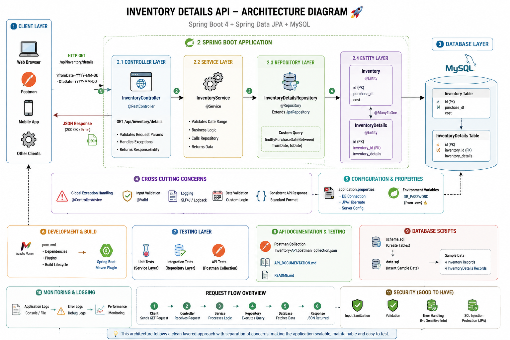

<div align="center">
  
# 📦 Inventory Details API

**A robust, scalable RESTful service to manage and retrieve inventory details across custom date ranges.**

[](https://spring.io/projects/spring-boot)
[](https://openjdk.java.net/projects/jdk/17/)
[](https://www.mysql.com/)
[](https://maven.apache.org/)

</div>

---

## 📖 Overview

The **Inventory Details API** is a high-performance backend microservice developed in Spring Boot. It provides endpoints for retrieving detailed inventory transaction records bounded by a specified date range. Designed with a clear separation of concerns, the application adheres to standard enterprise patterns, ensuring robust error handling, scalability, and ease of maintenance.

---

## 🏗 Architecture

The system is built on a standard Multi-Tier (N-Tier) Architecture, ensuring separation of concerns:



1. **Controller Layer**: Handles incoming HTTP requests and validates parameters.
2. **Service Layer**: Contains core business logic and processes data between the controller and repository.
3. **Repository Layer**: Utilizes Spring Data JPA to interact directly with the MySQL database.
4. **Database**: MySQL relational database holding normalized `Inventory` and `InventoryDetails` tables.

---

## 🛠 Tech Stack

- **Framework**: Spring Boot 4
- **Language**: Java 17
- **Database**: MySQL 
- **ORM**: Spring Data JPA / Hibernate
- **Build Tool**: Maven

---

## 🗄 Database Schema

The database consists of two core tables linked via a Foreign Key relation on `inventory_id`:

- `Inventory`: Stores the core metadata about inventory items.
- `InventoryDetails`: Stores granular transactional or purchase details linked to specific items.

---

## 🚀 Getting Started

### Prerequisites

- Java 17+
- MySQL 8.0+
- Maven 3.8+

### Installation & Setup

1. **Clone the repository:**
   ```bash
   git clone https://github.com/Pratham-Nandgaonkar/Inventory_API_Assignment1.git
   cd Inventory_API_Assignment1
   ```

2. **Configure Database Credentials:**
   Create a `.env` file in the root directory (using `.env.example` as a template) or directly configure your `DB_PASSWORD` in `src/main/resources/application.properties`.

3. **Start MySQL Database:**
   Ensure your MySQL server is running and the necessary schema is imported from `database/schema.sql` and `database/data.sql`.

4. **Run the Application:**
   ```bash
   ./mvnw spring-boot:run
   ```
   The server will start on `http://localhost:8080`.

---

## 📡 API Reference

### Get Inventory Details by Date Range

Retrieves all inventory details where the purchase date falls within the provided bounds.

- **URL**: `/api/inventory/details`
- **Method**: `GET`
- **Query Parameters**:
  - `fromDate` (String, Required): The start date in `YYYY-MM-DD` format.
  - `toDate` (String, Required): The end date in `YYYY-MM-DD` format.

#### Success Response (200 OK)

```json
[
  {
    "detailId": 1,
    "inventoryId": 101,
    "purchaseDate": "2023-08-15",
    "quantity": 50,
    "cost": 1500.00
  },
  {
    "detailId": 2,
    "inventoryId": 102,
    "purchaseDate": "2023-08-20",
    "quantity": 25,
    "cost": 750.50
  }
]
```

#### Error Response (400 Bad Request)

```json
{
  "timestamp": "2023-08-24T12:00:00Z",
  "status": 400,
  "error": "Bad Request",
  "message": "Invalid date format or fromDate is after toDate"
}
```

---

## 🧪 Testing

The API includes automated tests validating core business requirements and edge cases. The following test scenarios are covered and fully pass:

- ✅ **Valid date range**: Returns correct data boundaries.
- ✅ **Date range with no records**: Returns empty JSON array gracefully.
- ✅ **Logical validation**: Fails safely when `fromDate > toDate`.
- ✅ **Missing parameters**: Handled safely with a `400 Bad Request`.
- ✅ **Invalid date format**: Handled safely with a `400 Bad Request`.

**Current Status:** `5/5 tests passing` 🟢

---

## 💡 Design Decisions

1. **Spring Data JPA**: Adopted for rapid, robust, and boilerplate-free database operations, allowing complex native queries or standard repository methods out-of-the-box.
2. **N-Tier Architecture (Controller-Service-Repository)**: Enforces single-responsibility, making unit testing simpler and the application easier to modify without cascading side effects.
3. **Centralized Exception Handling**: Implemented `@ControllerAdvice` to provide standardized JSON error responses, improving the DX for consumers consuming this API.
4. **Environment Variables**: Sensitive data such as database passwords are injected via `.env` or application properties, conforming to 12-Factor App methodology.